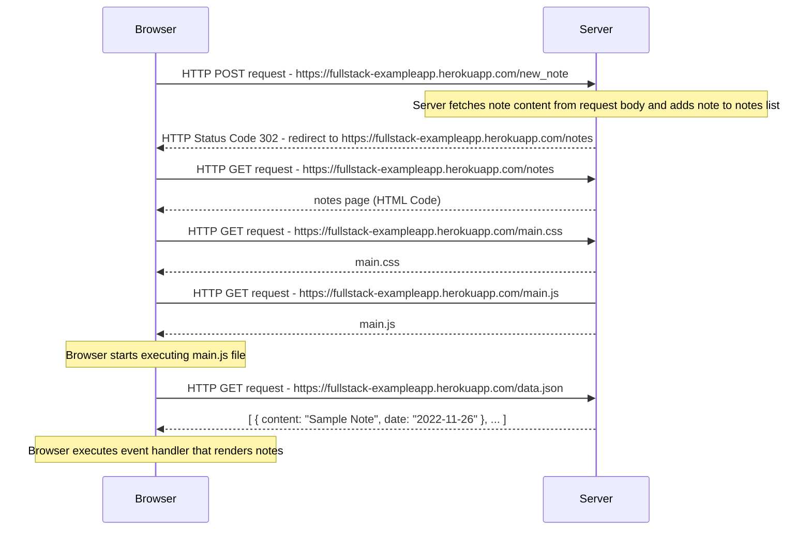

```mermaid
sequenceDiagram
  Browser->>Server: HTTP POST request - https://fullstack-exampleapp.herokuapp.com/new_note
  Note over Server: Server fetches note content from request body and adds note to notes list
  Server-->>Browser: HTTP Status Code 302 - redirect to https://fullstack-exampleapp.herokuapp.com/notes 
  Browser->>Server: HTTP GET request - https://fullstack-exampleapp.herokuapp.com/notes
  Server-->>Browser: notes page (HTML Code)
  Browser->>Server: HTTP GET request - https://fullstack-exampleapp.herokuapp.com/main.css
  Server-->>Browser: main.css
  Browser->Server: HTTP GET request - https://fullstack-exampleapp.herokuapp.com/main.js
  Server-->>Browser: main.js
  Note over Browser: Browser starts executing main.js file
  Browser->>Server: HTTP GET request - https://fullstack-exampleapp.herokuapp.com/data.json
  Server-->>Browser: [ { content: "Sample Note", date: "2022-11-26" }, ... ]
  Note over Browser: Browser executes event handler that renders notes
```
