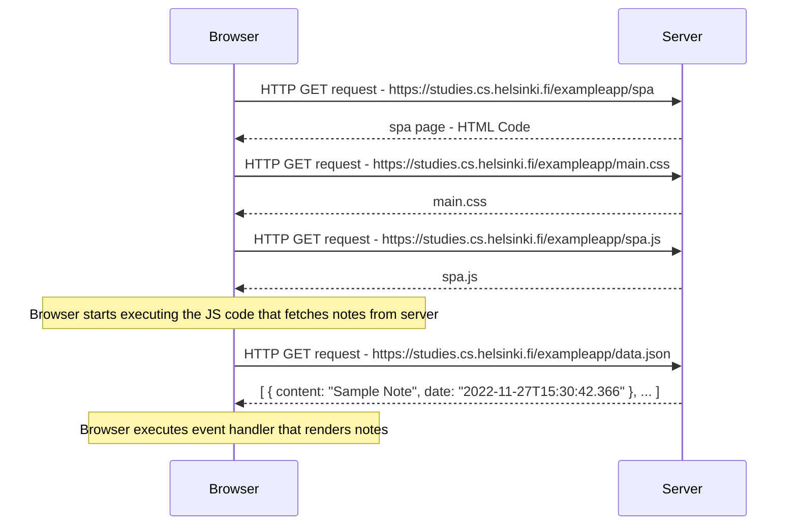

```mermaid
sequenceDiagram
  Browser->>Server: HTTP GET request - https://studies.cs.helsinki.fi/exampleapp/spa
  Server-->>Browser: spa page - HTML Code
  Browser->>Server: HTTP GET request - https://studies.cs.helsinki.fi/exampleapp/main.css
  Server-->>Browser: main.css
  Browser->>Server: HTTP GET request - https://studies.cs.helsinki.fi/exampleapp/spa.js
  Server-->>Browser: spa.js
  Note over Browser: Browser starts executing the JS code that fetches notes from server
  Browser->>Server: HTTP GET request - https://studies.cs.helsinki.fi/exampleapp/data.json
  Server-->>Browser: [ { content: "Sample Note", date: "2022-11-27T15:30:42.366" }, ... ]
  Note over Browser: Browser executes event handler that renders notes
```
