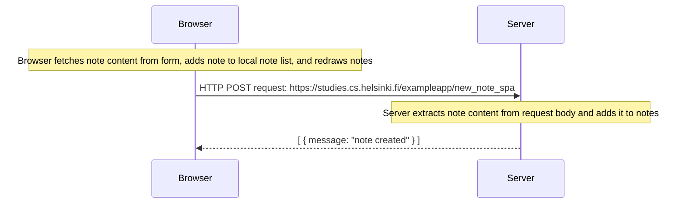

```mermaid
sequenceDiagram
    Note over Browser: Browser fetches note content from form, adds note to local note list, and redraws notes
    Browser->>Server: HTTP POST request: https://studies.cs.helsinki.fi/exampleapp/new_note_spa
    Note over Server: Server extracts note content from request body and adds it to notes
    Server-->>Browser: [ { message: "note created" } ]
```
